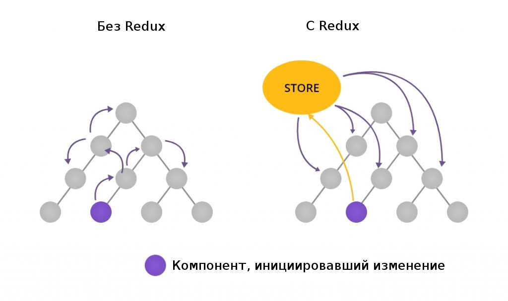
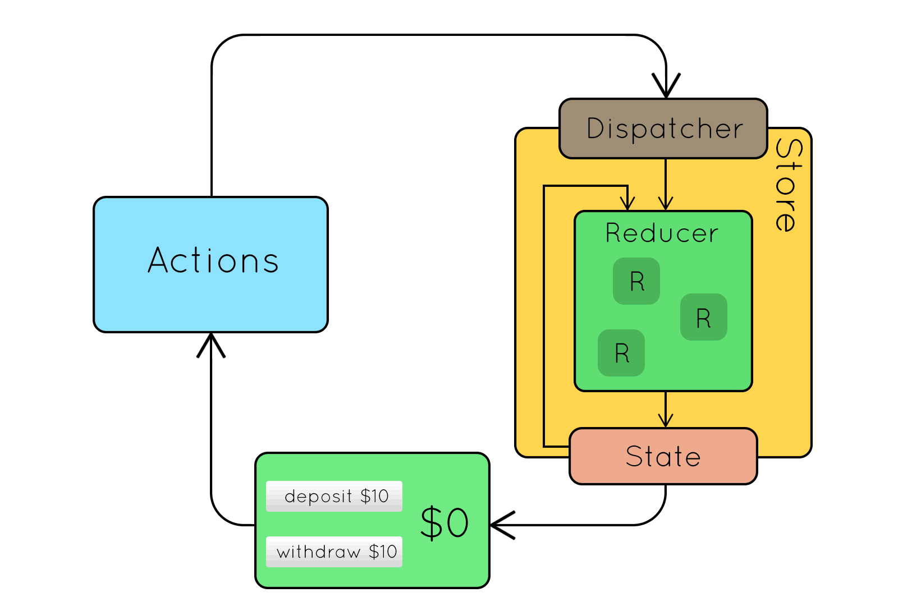

<div align="center"><h1> Redux</h1></div>

**Redux** - это библиотека для управления состоянием приложения

---

#### Redux нужен для следующих целей:
- Централизация управления состоянием: Redux позволяет хранить всё состояние приложения в одном месте, называемом "store". Это упрощает управление состоянием, особенно в сложных приложениях, где состояние может быть разбросано по множеству компонентов.
- Предсказуемость: В Redux все изменения состояния происходят последовательно и в определенном порядке. Это делает поведение приложения более предсказуемым и облегчает отладку.
- Упрощение тестирования: Централизованное управление состоянием и предсказуемость Redux позволяют легче писать тесты для приложений.
- Разделение логики: Redux применяет концепцию "reducers" и "actions" для разделения логики приложения. Reducers - это чистые функции, которые принимают текущее состояние и экшн, а затем возвращают новое состояние. Actions - это объекты, которые описывают, какое изменение состояния должно произойти. Это позволяет легче находить и модифицировать логику приложения.
- Поддержка разработки: Redux имеет встроенные инструменты разработки, такие как Redux DevTools, которые облегчают отслеживание изменений состояния и отладку приложений.

<div align="center">

</div>

---

#### Из чего состоит Redux

1.  **Store (хранилище)**: Хранилище является центральным местом, где хранится состояние вашего приложения. В Redux есть только одно хранилище, которое содержит объект с текущим состоянием. Хранилище предоставляет методы для доступа к состоянию, обновления состояния и подписки на изменения.
    
2.  **Actions (действия)**: Действия - это объекты, которые описывают, какое изменение состояния должно произойти. Они имеют свойство `type`, которое указывает на тип действия, и могут содержать дополнительные данные, необходимые для обновления состояния.
    
3.  **Reducers (редукторы)**: Редукторы - это чистые функции, которые принимают текущее состояние и действие, а затем возвращают новое состояние. Они определяют, как состояние должно быть обновлено на основе типа действия. Редукторы обеспечивают предсказуемость, так как они не изменяют текущее состояние, а создают новый объект состояния.
    
4.  **Middleware (промежуточное программное обеспечение)**: Middleware в Redux - это функции, которые могут быть использованы для расширения функциональности и изменения потока обработки действий. Middleware может быть использовано для различных целей, таких как асинхронные операции, логирование, обработка ошибок и другое. В Redux существует множество готовых middleware, которые можно использовать в своем приложении,
таких как:
```js
1.  Redux-thunk: Позволяет обрабатывать асинхронные действия, используя функции, возвращающие другие функции (thunk).
2.  Redux-saga: Обрабатывает асинхронные операции и более сложную логику с помощью генераторов.
3.  Redux-logger: Автоматически логирует все действия и изменения состояния.
4.  Redux-promise: Обрабатывает асинхронные действия, возвращающие обещания (Promise).
```
5.  **Dispatch (диспетчер)**: Диспетчер - это функция, предоставляемая хранилищем, которая позволяет отправлять (диспетчеризировать) действия к хранилищу. Когда действие отправляется, Redux вызывает соответствующий редуктор с текущим состоянием и действием, а затем сохраняет новое состояние, возвращенное редуктором.
    
6.  **React Redux**: React Redux - это официальная библиотека для связывания Redux с React-приложениями. Она предоставляет компонент `Provider` для передачи хранилища всем компонентам приложения и хуки, такие как `useSelector` и `useDispatch`, для работы с состоянием и действиями в компонентах React.

<div align="center">

</div>

---

## Пример работы с Redux:

#####  пример 1 -  Counter

1. **Type**: Определим типы действий которые будут в Reduce.
```js
export const INCREMENT = "INCREMENT";
export const DECREMENT = "DECREMENT";
```
2.  **Actions**: Определим действия, которые могут произойти в приложении. В данном случае, это увеличение и уменьшение счетчика.
```js
import { INCREMENT, DECREMENT} from "./type.redux"

// actions.js
export const increment = () => ({ type: INCREMENT });
export const decrement = () => ({ type: DECREMENT });
```
3.  **Reducers**: Создадим reducer, который будет обрабатывать действия и обновлять состояние.
```js
import { INCREMENT, DECREMENT} from "./type.redux"
// reducer.js
const initialState = {
  count: 0,
};

export const CounterReducer = (state = initialState, action) => {
const { type } = action;

  switch (type) {
    case INCREMENT:
      return { ...state, count: state.count + 1 };
    case DECREMENT:
      return { ...state, count: state.count - 1 };
    default:
      return state;
  }
};
```
4.  **Store**: Создадим хранилище, которое будет использовать наш reducer.
```js
// store.js
import { configureStore } from "@reduxjs/toolkit";
import { CounterReducer } from "./counter.reduce";

export const store = configureStore({
	reducer: {
		CounterReducer
	},
});
```
4.  **Компонент**: Создадим React-компонент, который будет использовать действия и состояние из Redux.
```js
// Counter.js
import React from "react";
import { useSelector, useDispatch } from "react-redux";
import { increment, decrement } from "./actions";

const Counter = () => {
  const count = useSelector((state) => state.count);
  const dispatch = useDispatch();

  return (
    <div>
      <h1>{count}</h1>
      <button onClick={() => dispatch(increment())}>+</button>
      <button onClick={() => dispatch(decrement())}>-</button>
    </div>
  );
};

export default Counter;
```
5.  **Подключение**: Подключим Redux к нашему приложению.
```js
// index.js
import React from "react";
import ReactDOM from "react-dom";
import { Provider } from "react-redux";
import { store } from "./redux/store";
import Counter from "./Counter";

ReactDOM.render(
  <Provider store={store}>
    <Counter />
  </Provider>,
  document.getElementById("root")
);
```

#####  пример 2 -  Posts

1. **Type**: Определим типы действий которые будут в Reduce.
```js
// type.redux.js
export  const  GET_ALL_POSTS  =  'GET_ALL_POSTS';
export  const  REMOVE_ONE_POST  =  'REMOVE_ONE_POST';
export  const  CREATE_POST  =  'CREATE_POST';
export  const  LOADED_POST  =  'LOADED_POST';
```
2.  **Actions**: Определим действия, которые могут произойти в приложении. 
```js
// post.action.js
import {
CREATE_POST, GET_ALL_POSTS, REMOVE_ONE_POST, LOADED_POST,
} from  './type.redux';

export  const  setAllPostsAction  = (data) => ({ type: GET_ALL_POSTS, payload: data });
export  const  removeOnePostAction  = (postId) => ({ type: REMOVE_ONE_POST, payload: Number(postId) });
export  const  createPostAction  = (post) => ({ type: CREATE_POST, payload: post });
export  const  loadedPostAction  = () => ({ type: LOADED_POST });
```
3.  **Reducers**: Создадим reducer, который будет обрабатывать действия и обновлять состояние постов.
```js
// post.reduce.js
import {
CREATE_POST, GET_ALL_POSTS, REMOVE_ONE_POST, LOADED_POST,
} from  './type.redux';

/* eslint-disable default-param-last */
const  initialState  = {
	posts: [],
	loaded: false,
	test: 'testing',
};

const  PostReducer  = (state  =  initialState, action) => {
	const { type, payload } =  action;

	switch (type) {
		case  GET_ALL_POSTS:
			return { ...state, posts: payload };
		case  REMOVE_ONE_POST:
			return { ...state, posts: state.posts.filter((p) =>  p.id !==  payload) };
		case  CREATE_POST:
			return { ...state, posts: [...state.posts, payload] };
		case  LOADED_POST:
			return { ...state, loaded: true };
		default:
			return  state;
	}
};

export  default  PostReducer;
```
4.  **Store**: Создадим хранилище, которое будет использовать наш reducer.
```js
// store.js
import { configureStore } from "@reduxjs/toolkit";
import PostReducer from "./post.reduce";

const store = configureStore({
	reducer: {
		PostReducer
	},
});
export  default  store;
```
4.  **Селектор**:  Добавляем функцию для селектора (не обязательно, делается для удобства)
```js
// post.selector.js
export  const  getAllPostsSelector  = (state) =>  state.PostReducer.posts;
```
5.  **Компонент**: Создадим React-компонент, который будет использовать действия и состояние из Redux, так же используем dispatch(прокидывает экшн для удаления) и useSelector(для получения всех постов).
```js
// PostList.jsx
import React, { useState, useCallback } from  'react';
import { useDispatch, useSelector } from  'react-redux';
import { removeOnePostAction } from  '../../redux/post.action';
import PostListItem from  '../PostListItem/PostListItem';
import { getAllPostsSelector } from  '../../redux/post.selector';

function  PostList() {
	const [text, setText] =  useState('');
	const  dispatch  =  useDispatch();
	const  posts  =  useSelector(getAllPostsSelector);

const  handleRemove  =  useCallback((postId) => {
	fetch(`http://localhost:6622/api/post/${postId}`, {
		method: 'DELETE',
		credentials: 'include',
	})
	.then((res) => {
		if (res.ok) {
			dispatch(removeOnePostAction(postId));
		}
	})
	.catch(console.error);
	}, []);

	return (
		<div>
			<input  type="text"  name="text"  value={text}  onChange={(e) =>  setText(e.target.value)}  />
			{posts.map((post) => (
				<PostListItem
				key={post.id}
				title={post.title}
				userId={post.userId}
				handleRemove={handleRemove}
				postId={post.id}/>
			))}
		</div>
	);
}

export  default  PostList;
```
6.  **Подключение**: Подключим Redux к нашему приложению.
```js
// index.js
import React from "react";
import ReactDOM from "react-dom";
import { Provider } from "react-redux";
import { store } from "./redux/store";

ReactDOM.render(
  <Provider store={store}>
    <App />
  </Provider>,
  document.getElementById("root")
);
```
